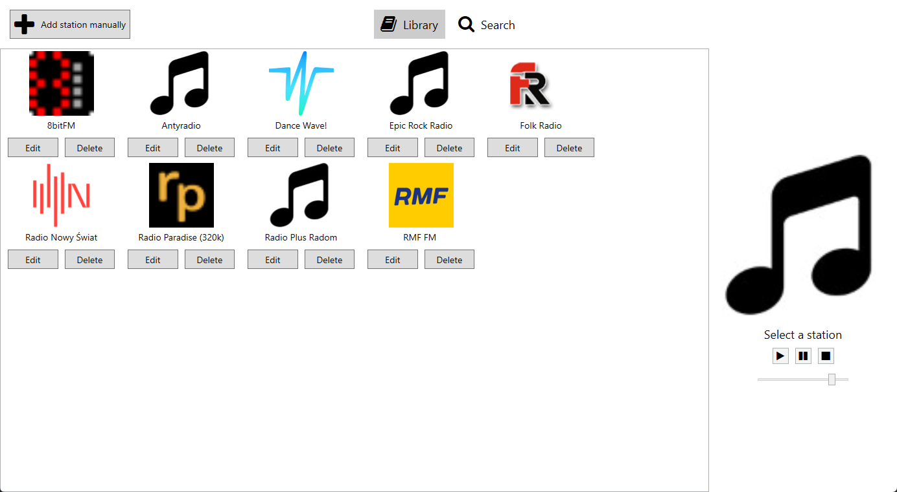

# MuseJet - Internet Radio Player

MuseJet has access to the [RadioBrowser](https://www.radio-browser.info/) database which gives access to over 30,000 radio stations from around the world.  
The design is heavily inspired by [Shortwave](https://gitlab.gnome.org/World/Shortwave).

## Screenshots

